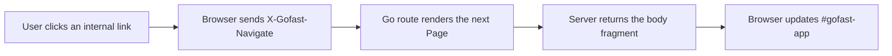

Gofast helps you build Go applications that render on the server and still feel quick in the browser.

Routes, layouts, rendering, and application structure stay in Go. The browser gets a small navigation layer that intercepts same-origin links, fetches the next rendered fragment, and updates the page without a full reload.

Use it when you want SPA-style navigation without moving your application model into a JavaScript framework.

## Why Gofast?

| You want | Gofast gives you |
| --- | --- |
| Go-first application code | Routes and page rendering written in Go |
| Understandable HTML | Handlers return HTML close to what the browser receives |
| Faster internal navigation | Same-origin links update the page body without a full reload |
| Less frontend build weight | JavaScript stays focused on browser coordination |

## Install it

```bash
go get github.com/EzekielRiv1/gofast
```

Gofast is a normal Go module. You do not need Node.js to run a Gofast app. Node.js is only used for the documentation site and optional tooling.

## Create your first page

```go
package main

import "github.com/EzekielRiv1/gofast"

func main() {
	app := gofast.New()

	app.Get("/", func(*gofast.Context) gofast.Page {
		return gofast.Page{
			Title: "Home",
			Body:  gofast.HTML("<h1>Hello from Go</h1>"),
		}
	})

	_ = app.ListenAndServe(":8080")
}
```

Open `http://localhost:8080`. The page is server-rendered HTML, served by a regular Go HTTP server.

## How it works

1. A browser requests a route.
2. Your Go handler returns a `gofast.Page`.
3. Gofast renders the full document for normal page loads.
4. For internal navigation, the browser asks for only the next page body.
5. The small browser layer swaps that body into `#gofast-app` and updates the title.



## When to use it

Gofast is a good fit when your team wants:

- Go handlers to remain the center of the application.
- Server-rendered pages that work with or without JavaScript.
- SPA-like transitions for normal links.
- A small framework surface that is easy to inspect.

It may not be the right fit when your application depends on heavy client-side state, offline-first behavior, or a complex browser-only interface.

## Avoid this mistake

Do not treat Gofast like a frontend framework with a Go backend attached. Keep domain logic, routing, authorization, data loading, and rendering decisions in Go. Use JavaScript only when the browser needs to coordinate navigation or interaction.

## Next steps

- [Install Gofast](installation)
- [Download and run the example](download)
- [Create an app](create-an-app)
- [Learn routing](routing)
- [Understand the browser layer](browser-layer)
