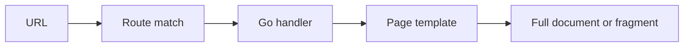

Gofast is a small Go framework for building server-rendered applications that navigate like single-page apps.

Use it when you want Go to own routing, rendering, and application structure, while the browser handles fast same-origin navigation.

## First example

```go
package main

import "github.com/ezekielriv1/gofast"

func main() {
	app := gofast.New()

	app.Get("/", func(ctx *gofast.Context) gofast.Page {
		return ctx.HTMLPage("Home", gofast.HTML("<h1>Hello from Go</h1>"))
	})

	_ = app.ListenAndServe(":8080")
}
```

Run the app and open `http://localhost:8080`.

## Why Gofast?

| You want | Gofast gives you |
| --- | --- |
| A Go-first app model | Route handlers, URL generation, and rendering in Go |
| Server-rendered pages | Normal HTTP routes that still work without JavaScript |
| SPA-style link clicks | Internal links can update the page without a full reload |
| Reusable page templates | Go `html/template` rendering through `Views` |

## How it works

1. A browser requests a route.
2. Gofast matches the route and resolves any path parameters.
3. Your handler returns a `gofast.Page`.
4. For internal navigation, the browser asks for only the next page body.
5. Gofast returns a fragment, and the browser swaps it into `#gofast-app`.



## When to use it

Gofast is a good fit when you want:

- a Go server as the center of the app;
- explicit routes instead of file-system routing;
- server-rendered HTML with quick internal navigation;
- templates and helpers that stay close to Go's standard library.

Choose another approach when the main challenge is offline-first behavior, a large client-side state machine, or a complex browser-only interface.

## Start here

- [Install Gofast](installation)
- [Create your first app](create-an-app)
- [Learn routing](routing)
- [Render templates](rendering)
- [Understand browser navigation](browser-layer)
